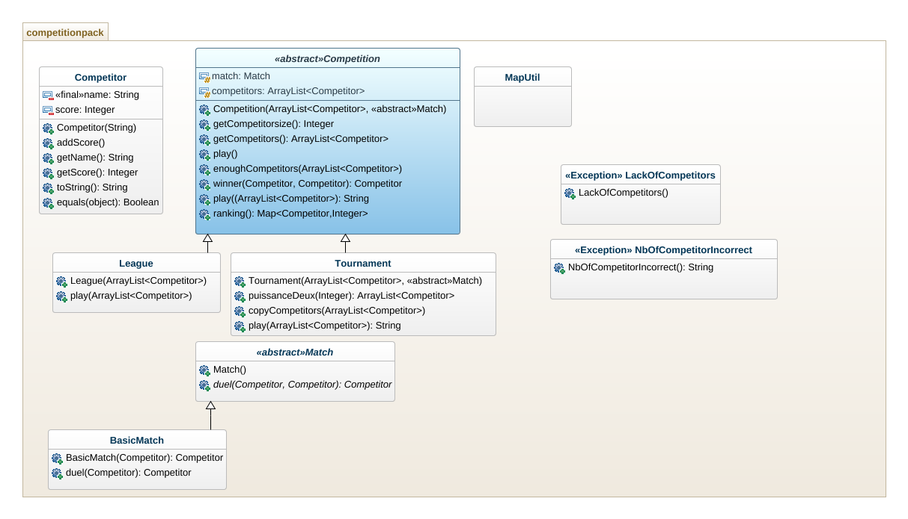

------------------------------------------------------------
# Projet COO : réalisé par : JOUHRI Toufik & JARIR Yassine.|
------------------------------------------------------------

# Objectifs :

La troisième partie consiste à créer un système de cote et la diffusion du résultat de la compétition , pour cela on avait pensé à utiliser le design pattern Observer. 


# compiler le projet :

grâce au terminal et à l'interieur du dossier "Jouhri-Jarir-COO-Projet/src" , éxecutez la ligne de commande si dessous qui va créer les fichiers .class dans le dossier classes  (qui vient d'être créer avec la commande)s :
```
javac competitionpack/*.java -d ../classes
```

# récupérer la JavaDoc :

-l'intérieur du dossier "Jouhri-Jarir-COO-Projet/src" , éxecutez la commande suivante qui génèrera la javadoc dans un dossier "docs"  :

```
javadoc -d ../docs -subpackages competitionpack

```
# Génération de l'archive du projet :

- Pour la génération de l'archive il faut être dans le dossier "Classes" générer par la complation:

```
jar cvfm ../competitionpack.jar ../manifest-sc competitionpack
```

# Executer l'archive :

-Retournez dans le répértoire "Jouhri-Jarir-COO-Projet" puis éxecutez la commande suivante :

```
java -jar competitionpack.jar
```

# Explications des choix pris lors du codage :
V1 :
1/ la création d'une classe abstraite 'Match' nous faciliterait la tâche pour la suite du projet afin d'implémenter des nouveaux matchs autre que le match normal "BasicMatch".

2/ Création des deux exceptions ("LackOfCompetitors" et "NbOfCompetitorincorrect") afin de guider l'utilisateur en cas d'échec dans l'insertion d'une liste de participants dans n'importe quelle competition (league ou tournois).

3/ l'utilisation de Map pour faciliter la collection des scores et les trier en décroissant.

V2:
1/ Pour la selection de la phase final on a opté pour le design pattern Strategy , l'interface SelectionStrategy avec ses deux classes filles FirstStrategy (qui prend le meilleur de chaque pool) et SecondStrategy (Les deux premiers de chaque pool)

2/ avoir un nombre de competiteur supérieur à 6 et pas de condition sur le nombre pair . la méthode makePools de la classe Pool s'adaptera en fonction du nombre de compétiteurs donné.

3/ création de la classe fillNumberToPowerOfTwo qui permet de rajouter des joueurs à la liste des compétiteurs qui joueront à la phase final pour atteindre un nombre 2^n (si nécessaire)

V3:
1/ l'augmentation et la diminution de la cote d'un participant en fonction du résultat de son match joué.

2/ Possibilité de set une cote à un participant (dans le cas ou le participant préserve sa cote pour une autre compétition)

 
### UML :



